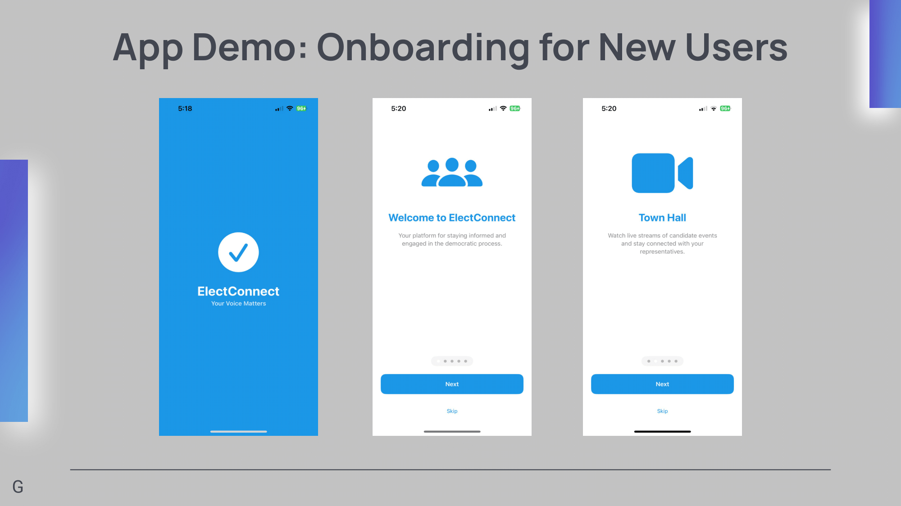
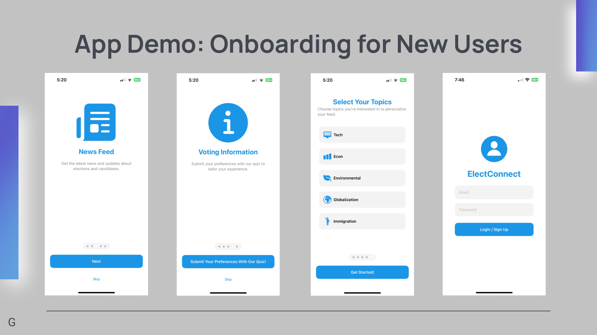
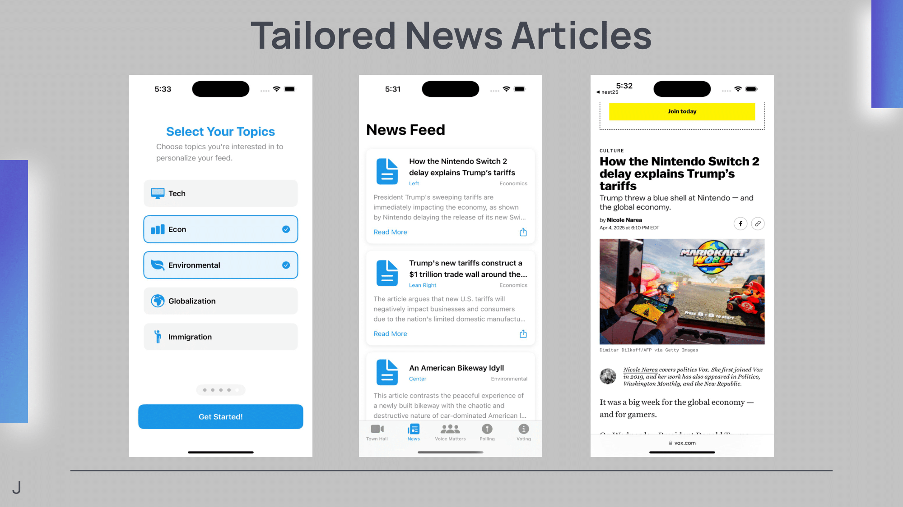
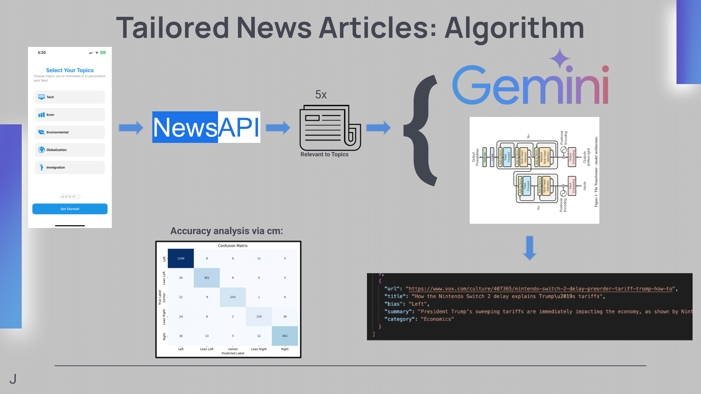
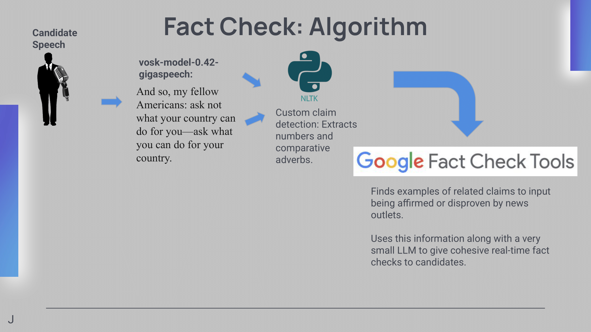
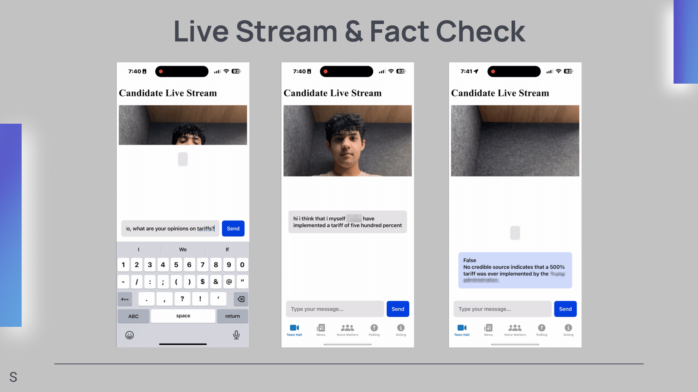
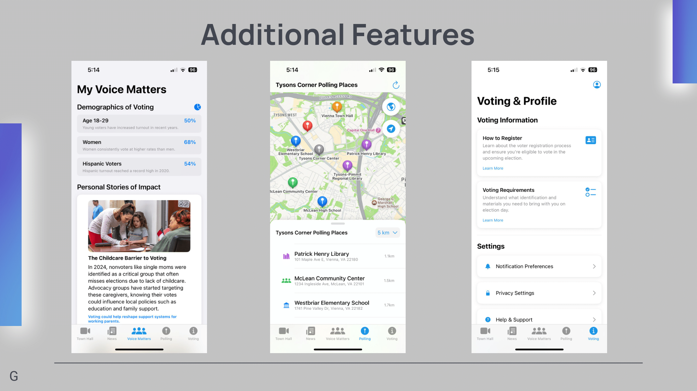

#  ElectConnect | HackTheNest Winner

https://apps.apple.com/us/app/elect-connect/id6753926496

ElectConnect is a civic engagement mobile app designed to increase voter participation — especially among underrepresented communities, by simplifying access to reliable, personalized election information.

##  Problem

Millions of eligible voters face confusion, misinformation, and a lack of trustworthy resources when it comes to voting. These barriers disproportionately affect underrepresented communities and new citizens, leading to lower voter turnout and reduced civic participation.

## Our Solution

**ElectConnect** breaks down these barriers by offering a **secure, user-friendly platform** that provides:

- **Personalized Voting Info**  
  Register to vote, view upcoming elections, and explore candidates relevant to your location.

- **Fact Check Engine**  
  Our custom-built NLP algorithm extracts numerical data and comparative language from political statements and compares them against verified claims from news outlets. A lightweight LLM then generates real-time, contextual fact checks—so users can separate truth from spin during debates and town halls.

- **Local Resources**  
  Get information about nearby voting centers, how to vote in your state, and hyper-local political stories based on your location.

- **Civic Engagement Features**  
  Participate in online town halls, follow issue-based news, and stay up-to-date with personalized civic updates to remain informed and involved.

## Inspiration

ElectConnect was inspired by a relative who recently became a U.S. citizen and struggled to understand where and how to vote. This experience revealed a widespread issue for individuals with limited prior political involvement, motivating us to build a platform that bridges this gap for everyone.

## Core Technologies

- **NLP-based Fact Checker**: Extracts and verifies political claims in real time using a custom pipeline and lightweight LLM.
- **Geolocation Services**: Finds local voting centers and regional voting rules.
- **Mobile-first UX**: Built for accessibility and clarity, with underrepresented users in mind.
- **Real-time Personalization**: News and voting info tailored to user location and preferences.

## Impact

ElectConnect empowers users—especially from marginalized or less-informed backgrounds—to confidently navigate elections. By turning civic confusion into civic action, we aim to boost participation, foster community awareness, and strengthen democracy.
---

